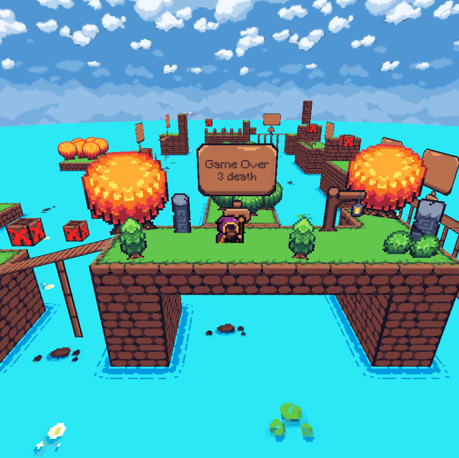

# My Portfolio, projects sorted by category
### Oscar Dewasmes

  
## 💼**Profesional projects**
Here are the publicly available projects I worked on in a profesional context.
- ⭐ [Fine tuning d'un modèle de vision artificielle](https://rebootia.com/2024/04/09/fine-tuning-pour-la-reconnaissance-de-pietons-et-vehicules-dans-un-entrepot/)
- ⭐[Génération d'un dataset synthétique d'images avec Blender](https://rebootia.com/2024/04/05/dataset-synthetique-grace-au-rendu-3d-dans-blender/)
- ⭐[Systèmes multi-agents, la méthode Eco Problem Solving](https://rebootia.com/2024/03/22/systemes-multi-agents-la-methode-eco-problem-solving/)
- [Introduction au fonctionnement d'un réseau de neuronnes par l'exemple](https://rebootia.com/2024/06/10/demystification-mathematiques-le-fonctionnement-dun-reseau-de-neurones/)

  
## 🎒 **School projects**
Here are the school projects I have made, often in groups.
- ⭐ [pAIcmain](https://github.com/kalharko/paicman) Multi agent strategies for team vs team pacman game.
- ⭐ [splendia](https://github.com/kalharko/splendia) Web browser version of the board game Splendor. Development of Artificial Inteligence. 
- ⭐ [it45-project](https://github.com/kalharko/it45-project) Operational research class, we solved a time table problem with the Simulated annealing algorithm. (C)
- [curses-turing-machine](https://github.com/kalharko/cursesTuringMachine) A programmable turing machine visualization in ncurses for an algorithm and quantum algorithms class (Python)
- [LO21](https://github.com/kalharko/projet-LO21) An expert database done for an algorithmic and programming class (C)
- [IFE](https://github.com/AlexisBouligand/The-Belotte-Project) A coinch game application, GUI made with SDL (C)
- [IFD2](https://github.com/louisgiac/projet-ifd2) Code for a connected mail box

  
## 🎮 **Game Jams**
(on my [itch.io](https://abi-oscar.itch.io/) page) Game jams organised by the student club of game making at the UTBM.

- ⭐ [Alien Sushi](https://carl-r.itch.io/alien-sushi) Playable in browser (21h jam)  

- ⭐ [Orbital Market](https://abi-oscar.itch.io/orbital-market) Playable in browser (32h jam)  

- ⭐ [Splouch](https://abi-oscar.itch.io/splouch) Playable in browser (1 week jam)  

- [Aoc 2021 day 11](https://abi-oscar.itch.io/aoc-day-11) Playable in browser. This is a visualization of the Advent of Code 2021 day 11 problem.

  
## 🪐 **Blender**
I love Blender and the large number of possible ways to be creative with it. Here are my projects done with Blender :

 - ⭐ [On Tumblr](https://kalharko.tumblr.com/)  
 
 - [On Youtube](https://www.youtube.com/channel/UCboGMqJM4QhAgs_mOdBCA3g) (one animation)

  
## 📝 **Table Top Role Playing Games**
The way ttrpg get people together is what I love about it.

- ⭐ [petit-jdr-universel](https://github.com/kalharko/petit-jdr-universel) Universal system with modular rules (in French)
